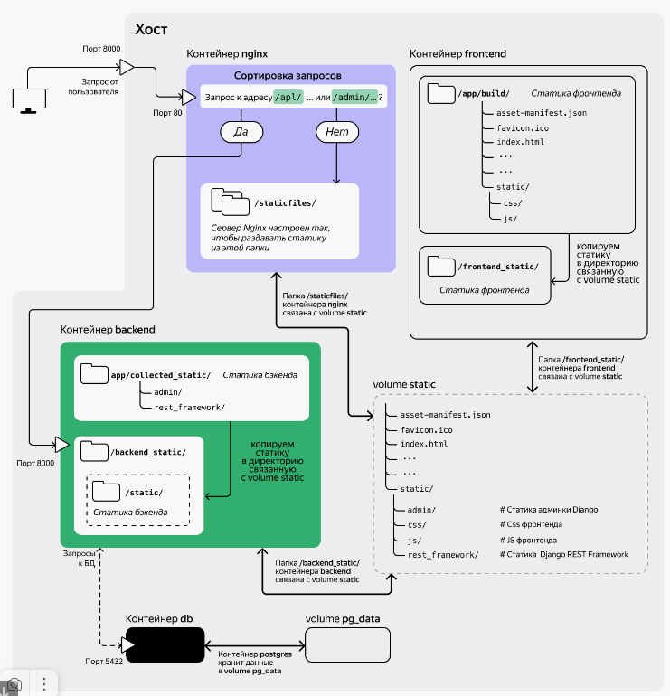
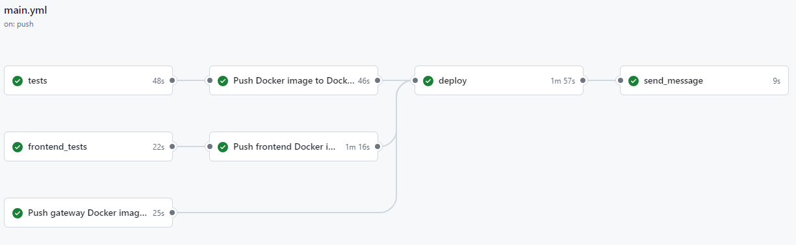

[](https://github.com/khadakhan/foodgram/actions/workflows/main.yml)

# Foodgram:
Foodgram - service for those who love to eat deliciously. In Foodgram, even an unregistered user can view recipes that interest him. And after registration, the user can:

* create your own recipe, edit your own recipe, delete your own recipe;
* subscribe to another user;
* create favorites from other users' recipes;
* create a shopping cart by adding recipes to it, and then download a list of ingredients needed for cooking, indicating the quantity and units of measurement.

The project has an admin area. Where the administrator can create new tags for recipes (for example: breakfast, lunch, dinner). Supplement the list of ingredients. A script for loading ingredients from a csv file is available to the developer, a starter set of 2186 ingredients is available.

The application has a frontend SPA application on React and a backend (Django application).

# Deploy localy
The Docker containers we will be working with will use Linux as the operating system kernel. For Windows 10 and 11: install Windows Subsystem for Linux.

Install Windows Subsystem for Linux according to the instructions on the official Microsoft website. If your computer meets the system requirements, it will also be suitable for installing WSL2.

You can use any available terminal to work with Docker, to your taste: PowerShell, cmd, Git Bash, or the Ubuntu terminal from WSL. We recommend working in Git Bash.

After installing WSL: installing Docker on Windows
Go to the official website of the project and download the Docker Desktop installation file.
Run it: a program for managing containers (docker daemon) and docker clients - a graphical interface and a command line interface - will be installed on your computer.

## Packaging the project into a Docker image
In the backend/ directory of the project, create a file called Dockerfile. The name must begin with a capital letter; the extension does not need to be specified. Fill the file with the following instructions:

```
FROM python:3.9

WORKDIR /app

RUN pip install gunicorn==20.1.0

COPY requirements.txt .

RUN pip install -r requirements.txt --no-cache-dir

COPY . .

CMD ["gunicorn", "--bind", "0.0.0.0:8000", "backend.wsgi"]
```
Some files and directories should not be included in the image: they are not needed there, and should be excluded when copying. Such exclusions can be listed in the .dockerignore file; it should be located in the same directory as the Dockerfile. The .dockerignore file works the same way as .gitignore. Add the following directories and files to it:
```
venv
.git
db.sqlite3
```
There are also other files that should be added to .dockerignore:
* IDE files: .idea, .vscode, and others;
* files with environment variables: for example, .env.

Project migrations should be included in the image, do not add them to .dockerignore.

## Building the foodgram backend image.
Make sure Docker is running. Open a terminal, go to the backend/ directory of the foodgram project and build the image:
```
docker build -t foodgram_backend .
```
Test run of the backend container:
```
docker run --name foodgram_backend_container --rm -p 8000:8000 foodgram_backend
```
Open the page http://localhost:8000/api/ in the browser, the application should respond.

Perform migrations in the foodgram_backend_container container:
```
docker exec foodgram_backend_container python manage.py migrate
```
Stop the container with Ctrl+C in the same terminal or with the command docker container stop foodgram_backend_container in a new terminal window. This will remove the container.

## Building the foodgram frontend image.
The Dockerfile must be placed in the frontend/ folder of the foodgram project.
The image in the app/build/ folder will store
static files (HTML, JS, and CSS) of the frontend application.

When the container starts, the built-in Node.js development web server is launched.
The statics are distributed directly from the container to port 8000.

To prevent dependency files and project builds from getting into the image,
add .dockerignore to the frontend/ directory.

Warnings about package versions may appear during the build — they can be ignored,
since these packages are used only when building the project.

In the frontend/ directory, place the .dockerignore file with the following contents:
```
node_modules
build
```
Go to the frontend directory and build the image:
```
docker build -t foodgram_frontend .
```
Run the container interactively, with the -it switch, and bind port 8000 of the container to port 8000 of the host:
```
docker run --rm -it -p 8000:8000 --name foodgram_frontend_test foodgram_frontend
```
Open a browser and make sure that the foodgram frontend is accessible at http://127.0.0.1:8000/. The frontend SPA does not interact with the backend yet: for this, you will need to configure them to run together; however, the web page opens successfully.

Stop the container with the Ctrl+C shortcut or run docker container stop foodgram_frontend_test in a new terminal window. This will remove the container.

## Application architecture


## PostgreSQL
In the root of the project, create a .env file:
```
# .env file
POSTGRES_USER=django_user
POSTGRES_PASSWORD=mysecretpassword
POSTGRES_DB=django
# Add variables for the Django project:
DB_HOST=db
DB_PORT=5432
```
Change the settings.py file to use these variables:
```
import os

...

# Replace the current DATABASES setting with these lines
DATABASES = {
    'default': {
        # Change the Django setting: now the postgresql
        # backend will be use for work
        'ENGINE': 'django.db.backends.postgresql',
        'NAME': os.getenv('POSTGRES_DB', 'django'),
        'USER': os.getenv('POSTGRES_USER', 'django'),
        'PASSWORD': os.getenv('POSTGRES_PASSWORD', ''),
        'HOST': os.getenv('DB_HOST', ''),
        'PORT': os.getenv('DB_PORT', 5432)
    }
}

...
```
Django uses the psycopg2-binary library to work with PostgreSQL. If you don't install it, the postgresql backend won't work.
Add the new psycopg2 package to the requirements.txt file.

Rebuild the foodgram_backend image with the updated dependencies file: in the backend/ directory, run the docker build command:
```
docker build -t foodgram_backend .
```
Docker volume for the PostgreSQL container:
```
docker volume create pg_data
```
In the PostgreSQL image, all data is stored in the /var/lib/postgresql/data directory. This is the directory that needs to be "redirected" to a volume outside the container:
```
docker run --name db \
       --env-file .env \
       -v pg_data:/var/lib/postgresql/data \
       postgres:13.10
# Start a container named db,
# pass environment variables from the .env file to the container,
# connect a Docker volume named pg_data,
# create a container from a postgres image with the 13.10 tag
```

## Docker network: a network of containers
Let's create a network named django-network:
```
docker network create django-network
```
Connect the backend and database containers to the network.
The db container is already running, you can immediately connect it to the docker network. Run the command:
```
# Connect the db container to the django-network network.
docker network connect django-network db
```
The container with the backend has not yet been launched, we will connect it to the network right at startup. The name of the network to which the container should connect is specified as a parameter of the --net key.
Start the container with the Django application:
```
docker run --env-file .env \
           --net django-network \
           --name foodgram_backend_container \
           -p 8000:8000 foodgram_backend
```
Now that both containers are running and networked, we can apply Django migrations. Open a new terminal window and run the migration command in the backend container:
```
docker exec foodgram_backend_container python manage.py migrate
```
Now when you stop the containers, the database information will be saved on the host.

## Сontainer and config for Nginx
Prepare to launch the container with Nginx - create a gateway/ folder in the root of the project with two files:
* Dockerfile - to create an Nginx image with the necessary settings;
* nginx.conf - to configure the Nginx server.

## Backend statics
First, in the foodgram, configure the collection of statics in the collected_static/ folder. In the settings.py file, check the value of the STATIC_URL constant and add the STATIC_ROOT constant:
```
# When planning the architecture, it was decided that
# Django static files should be available at /static/
STATIC_URL = '/static/'
# Specify the root directory for collecting static files;
# in the container, this will be /app/collected_static
STATIC_ROOT = BASE_DIR / 'collected_static'
# Now when calling the python manage.py collectstatic command
# Django will copy all static files to the collected_static directory
```
Also, the IP address and (if any) domain name of your server must be added to the ALLOWED_HOSTS list in the settings.py file.
```
ALLOWED_HOSTS = ['123.123.123.123', '<your_domain>']
```
Restart Docker Compose:
```
# Containers need to be rebuilt because settings.py was changed
docker compose stop && docker compose up --build
```
When the network started, volume static was connected to the backend and gateway containers.

Run the static build command. After that, run the command to copy the collected files to /backend_static/static/ — move the files not to /backend_static/, but to a subfolder: this way the file addresses for Nginx will match the addresses of the static files that the Django project expects.
```
# Collect Django statics
docker compose exec backend python manage.py collectstatic
# Application statics in the backend container
# will be collected in the /app/collected_static/ directory.

# Now copy statics from this directory to /backend_static/static/;
# this statics will go to volume static in the /static/ folder:
docker compose exec backend cp -r /app/collected_static/. /backend_static/static/
```

## Frontend statics
In docker-compose.yml, you need to make a couple of changes to the frontend container description:
declare the /frontend_static/ directory association with the static volume (the directory will be created automatically);
add the command key and run the file copy command: cp -r /app/build/. /frontend_static/.

## Local run
Restart Docker Compose and check the main page http://localhost:8000/:
```
docker compose stop && docker compose up
```
When accessing http://localhost:8000/ you should see the foodgram home page, which should now be fully functional. Test this by adding a task through the home page interface.

## Useful commands
Full list of commands
```
docker
```
Start a container from a hello-world image
```
docker run --name hello-container hello-world
```
Start an nginx container with host port forwarding to the container port
```
docker run -p 8080:80 --name nginx-container nginx
```
Delete a container nginx-container
```
docker container rm nginx-container
```
stop a container ctrl-c, start after stop
```
docker container start nginx-container
docker start nginx-container
```
stop a container
```
docker stop nginx-container
docker container stop nginx-container
```
remove a container
```
docker container rm foodgram_backend_container
```
list running containers
```
docker container ls
```
list all containers
```
docker container ls -a
```
To execute instructions in a container
```
docker exec -it <CONTAINER ID> any_instruction
```
command to run terminal in container:
```
docker exec -it nginx-container bash
```
create file in container:
```
docker exec nginx-container touch /my-file
```
To see list of images stored locally:
```
docker image ls
```
```
docker image --help
```
see unused images
```
docker image ls -f "dangling=true" -q
```
remove more unused images
```
docker image rm $(docker image ls -f "dangling=true" -q)
```
image build command
```
docker build -t foodgram_backend .
```
Test container run
```
docker run --name foodgram_backend_container --rm -p 8000:8000 foodgram_backend
```
Run migrations in the foodgram_backend_container container:
```
docker exec foodgram_backend_container python manage.py migrate
```
Delete volume
```
docker volume rm volume_name
```
Other volume commands
```
docker volume
```
Create volume
```
docker volume create pg_data
```
Build image for DockerHub
```
docker build -t username/foodgram_backend:latest backend/
```
Authenticate Docker daemon on DockerHub
```
docker login
```
Run container for PostgreSQL, having previously created all environment variables and volume
```
docker run --name db \
       --env-file .env \
       -v pg_data:/var/lib/postgresql/data \
       postgres:13.10
```
Run console psql client in container
```
docker exec -it db psql -U django_user -d Django
```
Create network
```
docker network create django-network
```
Attach to network django-network container db, which is already running
```
docker network connect django-network db
```
Start Django container with network connection
```
docker run --env-file .env \
           --net django-network \
           --name foodgram_backend_container \
           -p 8000:8000 foodgram_backend
```
Running migration after Django and Postgresql container are up and running
```
docker exec foodgram_backend_container python manage.py migrate
```
Version
```
docker compose version
```
Run the whole orchestra - in the terminal in the folder with docker-compose.yml run the command:
```
docker compose up
```
Containers need to be rebuilt because settings.py was changed
```
docker compose stop && docker compose up --build
```
It will be useful to run the command
```
sudo docker system prune -af
```
this will remove all unnecessary objects that you may have created in docker during the execution of sprint tasks - unused containers, images and networks.
```
sudo docker system prune --all
```
Go to the directory where the docker-compose.yml file is located and run migrations:
```
docker compose exec backend python manage.py migrate
```
Collect Django statics
```
docker compose exec backend python manage.py collectstatic
```
Application statics in the backend container
```
# will be collected in the directory /app/collected_static/.
# Now copy the statics from this directory to /backend_static/static/;
# this statics will go to the volume static in the folder /static/:
docker compose exec backend cp -r /app/collected_static/. /backend_static/static/ 
```
To remove both containers and volumes, run the command 
``` 
docker compose down -v 
```
You can see a list of such unnamed images (they are called dangling) like this:
```
docker image ls -f "dangling=true" -q
```
You can clean your computer from such images with this command:
```
docker image rm $(docker image ls -f "dangling=true" -q)
```

# Deploy on server
## Create docker-compose.production
Let's create a separate Docker Compose configuration file that will manage the launch of containers on the production server. It will be similar to the one that already exists, but it will use the built images from Docker Hub.

## Install Docker Compose on the server
Run the commands to install Docker and Docker Compose for Linux on the server one by one. Be patient: the installation will take some time. It is better to run them in the user's home directory (the cd command without arguments will help you move to it).
```
sudo apt update
sudo apt install curl
curl -fSL https://get.docker.com -o get-docker.sh
sudo sh ./get-docker.sh
sudo apt install docker-compose-plugin
```

## Run Docker Compose on the server
Copy the docker-compose.production.yml file to the foodgram/ directory on the server. You can do this, for example, using the SCP (secure copy) utility — it is designed to copy files between computers. Go to the foodgram/ directory on your computer and run the copy command:
```
scp -i path_to_SSH/SSH_name docker-compose.production.yml \
username@server_ip:/home/username/foodgram/docker-compose.production.yml
```
* path_to_SSH — path to the file with the SSH key;
* SSH_name — name of the file with the SSH key (without extension);
* username — your username on the server;
* server_ip — IP of your server.

Another option is to create an empty docker-compose.production.yml file on the server and use the nano editor to add the contents of the local docker-compose.production.yml to it.

Copy the .env file to the server, in the foodgram/ directory.

Don't forget about secrets in .env file in the foodgram/backend/foodgram_backend directory with:

* SECRET_KEY - секретный ключ для шифрования в Django.
* ALLOWED_HOSTS = [IP-adress, '127.0.0.1', 'localhost', domain name] 
* LOCAL DEBUG = 'on' - DEBUG=TRUE, 'off' - DEBUG=False
* DATA_BASE = 'postrgresql' for use PostgreSQL

To run Docker Compose in daemon mode, run docker compose up with the -d flag
```
sudo docker compose -f docker-compose.production.yml up -d
```
Check that all required containers are running:
```
sudo docker compose -f docker-compose.production.yml ps
```
Run migrations, collect backend static files and copy them to /backend_static/static/:
```
sudo docker compose -f docker-compose.production.yml exec backend python manage.py migrate

sudo docker compose -f docker-compose.production.yml exec backend python manage.py collectstatic

sudo docker compose -f docker-compose.production.yml exec backend cp -r /app/collected_static/. /backend_static/static/
```

## Redirect all requests to docker:
Earlier we have already deployed the foodgram application manually on the server without using docker, so the nginx settings remain:
```
# Up to this line is the rest of the server section
    location /api/ {
        proxy_set_header Host $http_host;
        proxy_pass http://127.0.0.1:8000;
    }

    location /admin/ {
        proxy_set_header Host $http_host;
        proxy_pass http://127.0.0.1:8000;
    }

    location / {
        root   /var/www/foodgram;
        index  index.html index.htm;
        try_files $uri /index.html =404;
    }
# Below is the part about certbot
```
It should look like this (replace three location blocks with one):
```
# Leave everything up to this line as it was.
    location / {
        proxy_set_header Host $http_host;
        proxy_pass http://127.0.0.1:8000;
    }
# You don't need to change anything below.
```
To make sure there are no errors in the config, run the configuration check command:
```
sudo nginx -t
```
Reload the Nginx config:
```
sudo service nginx reload
```
Open your project's admin page in your browser again - https://your_domain/ and check that everything is working

# Deployment automation: CI/CD
Create a .github/workflows directory in the foodgram/ folder, and in it — a main.yml file like in the repository.

Save the variables:
* DOCKER_USERNAME
* DOCKER_PASSWORD
* SSH_KEY - should contain the contents of a text file with a private SSH key
* SSH_PASSPHRASE
* USER - user on the server
* HOST - IP address of your server

with the necessary values ​​in the project secrets on GitHub

## Report in Telegram
Add the Telegram account parameters to the secrets for sending the report:
* in the TELEGRAM_TO variable, save the ID of your Telegram account. You can find out your ID from the Telegram bot @userinfobot. The bot will send notifications to the account with the specified ID;
* in the TELEGRAM_TOKEN variable, save the token of your bot. You can get this token from the telegram bot @BotFather.


Now your workflow consists of four phases:

Project testing.

Building and publishing the image.

Automatic deployment.

Sending a notification to a personal chat.

# Instruments and stack
#python #javascript #css #django #djangorestframework #REST API #bash #gunicorn #nginx #SSH #Docker #GitHub Actions

# Author
As an example, you can see the application at work at:
https://foodgramdo.zapto.org/

Project author: [khadakhan](https://github.com/khadakhan/)
